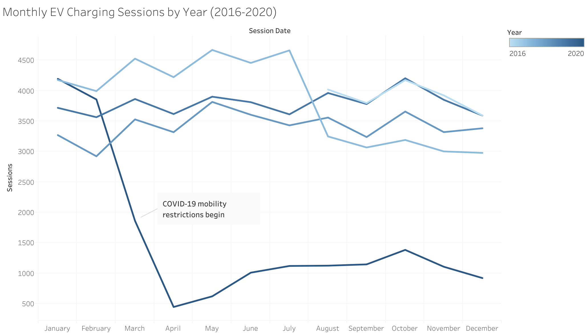

# EV Charging Station Usage Analysis (2016-2020)

## Table of Contents

- Project Background
- Executive Summary
- Insights Deep-Dive

## Project Background 

This project analyzes electric vehicle (EV) charging station usage in Palo Alto from 2016 to 2020. We will step into the shoes of an analyst for the station provider and try to extract some valuable insights from the dataset given. We will use session-level amd user-type of data, and our goal will be to understand how charging demand evolves over time, how usage is distributed across different stations and users, and how behavioral patterns contribute to infrastructure strain and patterns.

This analysis is intended to support data-driven decision-making for charging infrastructuren planning, demand management, and policy design that is focused on user patterns. We will give particular attention to temporal patterns, demand concentration, and differences in charging behavior across different types of charging users.

## Executive Summary

- EV charging usage shows relatively stable seasonal behavior with limited month-to-month consistency, but there is a clear disruption occurs in early 2020 due to COVID-19 mobility restrictions, confirming that external factors play the biggest role in session volume.

- Charging demand has become increasingly concentrated at a small subset of stations over time, suggesting that users develop preferences for certain stations, which call for investigation on if those certain stations have certain factors and specifics which make them more appealing/convinient for users.

- User behavior is highly skewed. While most users charge infrequently, a very small proportion of heavy users accounts for a disproportionate share of total energy consumption. This indicates that heavy useage users may contribute predicatable charging patterns and infrastructure congestion, which can be accomodated for.

- Higher session counts do not strongly correlate with higher energy per session, indicating multiple distinct charging behavior profiles. This calls for a possible separation of charging station specialties, to accomodate for different types of users in the area.

- Weekday charging demand consistency exceeds weekend demand, pointing to commuting and work week driven usage patterns.

Together, these finding suggest that station infrastructure stress is driven more by who charges, where charging occurs, and how individual stations are used, rather than overall user growth alone.

## Insights Deep-Dive

### Overall Usage Trends Over Time

