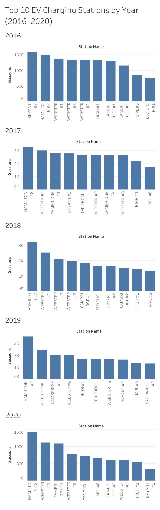
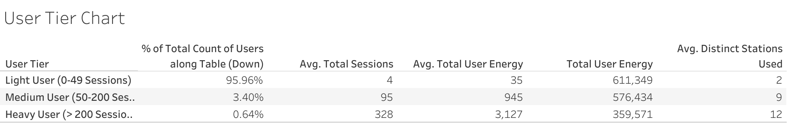
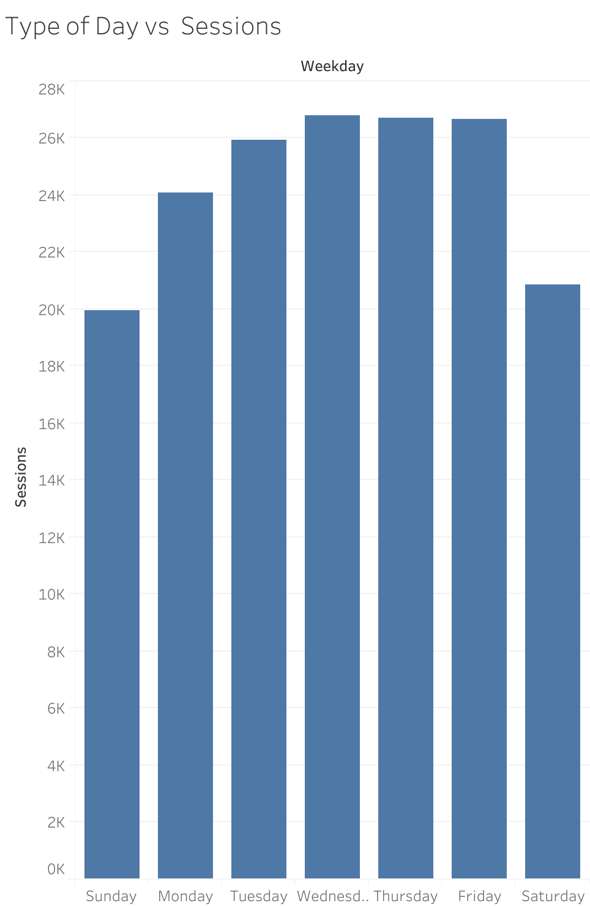

# EV Charging Station Usage Analysis (2016-2020)

## Table of Contents

- Project Background
- Executive Summary
- Insights Deep-Dive

## Project Background 

This project analyzes electric vehicle (EV) charging station usage in Palo Alto from 2016 to 2020. We will step into the shoes of an analyst for the station provider and try to extract some valuable insights from the dataset given. We will use session-level amd user-type of data, and our goal will be to understand how charging demand evolves over time, how usage is distributed across different stations and users, and how behavioral patterns contribute to infrastructure strain and patterns.

This analysis is intended to support data-driven decision-making for charging infrastructuren planning, demand management, and policy design that is focused on user patterns. We will give particular attention to temporal patterns, demand concentration, and differences in charging behavior across different types of charging users.

## Executive Summary

- EV charging usage shows relatively stable seasonal behavior with limited month-to-month consistency, but there is a clear disruption occurs in early 2020 due to COVID-19 mobility restrictions, confirming that external factors play the biggest role in session volume.

- Charging demand has become increasingly concentrated at a small subset of stations over time, suggesting that users develop preferences for certain stations, which call for investigation on if those certain stations have certain factors and specifics which make them more appealing/convinient for users.

- User behavior is highly skewed. While most users charge infrequently, a very small proportion of heavy users accounts for a disproportionate share of total energy consumption. This indicates that heavy useage users may contribute predicatable charging patterns and infrastructure congestion, which can be accomodated for.

- Higher session counts do not strongly correlate with higher energy per session, indicating multiple distinct charging behavior profiles. This calls for a possible separation of charging station specialties, to accomodate for different types of users in the area.

- Weekday charging demand consistency exceeds weekend demand, pointing to commuting and work week driven usage patterns.

Together, these finding suggest that station infrastructure stress is driven more by who charges, where charging occurs, and how individual stations are used, rather than overall user growth alone.

## Insights Deep-Dive

### Overall Usage Trends Over Time

This plot tracks session counts over the months, separated by year.

- Monthly charging sessions remain relatively stable across years, with no strong recurring seasonal pattern.

- There is a small, but recurring increase in sessions during October across every year, which suggest some type of seasonal effect, even if small.

- There is a noticeable drop in sessions from March-April 2020, aligning with the introduction of COVID-19 mobility restrictions, and confirmation to external factors being a difference-maker in session counts.

- Overall, this plot indicates that seasonal differences do not play a major role in session density, pointing differences in session counts to other, external factors.

### Station-Level Demand Concentration

This plot tracks the 10 most session-heavy stations over the years of the dataset.

- In earlier years (2016-2017), charging demand is more evenly distributed across stations, yet still being concentrateed on the most used stations.

- From 2018 onwards, demand becomes increasingly left-skewed, indicating that the small number of the most in-demand stations increase in their demand, potentially indicating user behaviors maturing into certain preferences. The specifications of what makes these stations convinient/more usable can be investigated further.

- This pattern suggests that bottlenecks in infrastructure are location-specific, and persistent/increasing as time moves forward.

### User Behavior & Segmentation

Users were segmented into Light (0-50 sessions), Medium (51-200 sessiosn), and Heavy (201+ sesssions):

- We can see that light users make up the wide majority of users (roughly 96 percent), but contribute relatively little to total energy usage per user.

- Heavy users represent less than 1% of users yet account for a substantial share of total energy consumption (roughly 23 percent)

- Heavy users charge at more distinct stations and have significantly higher average total energy usage per user, as expected.

- Medium users act as a transitional group, with behavior patterns that more closely resemble heavy users than light users.

These findings indicate that infrastructure demand is driven primarily by a small group of frequent users, rather than overall user volume. Heavy user patterns may be predictable, so future operations can serve the tendencies of this user type.

This plot tracks the relationship between how many sessions a station goes through, and how much energy is used per session.

- A weak positive relationship exists between total sessions, and average energy per session for a station. This means that on average, a more popular station will likely use more energy per station, but there is large variability in that correlation.

- The observed variability in session count and energy usage suggest that users use different stations in different ways and charging styles, with some stations serving as quick chargers, and others as longer and more energy-intensive chargers. This opens the possibility of introducing different types of stations, which serve what stations in that area are primarily used for.

Overall, planning decisions based solely on sessions may underestimate peak energy demand and how the stations are being used.

### Weekday vs Weekend Usage Patterns

This next plot analyzes aggregated session counts during different days of the week.

- Charging sessions peak consistently on weekdays, particularly Tuesday through Friday.

- Weekend usage is noticeably lower, with Sunday yielding the lowest total session count.

- This pattern aligns with the hypothesis of heavy users having predictable behaviour, where the commuter/work week siggest predictable temporal demand cycles.

- Operatioal planning, like maintenence on the weekends or pricing differences on weekdays, can make use of consistent weekday/weekend differences.

## Recommendations

The analysis above shows that infrastructure stress is not driven by an average, individual user, but by where demand concentrates, and who drives it. Therefore, any reccomendations should be focused on managing demand in distinct areas and addressing certain user behaviours.
Each reccomendation below is grounded in the preceding visualizations and resulting analyses.

### Prioritize Capacity Upgrades at High-Demand Stations
Across years, charging demands becomes increasingly concentrated at a small subset of stations. Later years show strong left-skew, where few stations are consistently dominating 

 
